# Boosting Camera Motion Control for Video Diffusion Transformers
Accepted into BMVC 2025.
Project Page: https://soon-yau.github.io/CameraMotionGuidance/

Existing camera control methods for U-Net do not work for diffusion transformers. We developed the first camera control for space-time diffuser transformer. Our method, based on classifier-free guidance, restore controllability and boost motion by over 400%.

### 🚀 Camera Motion Guidance
 Conventionally, no guidance is used in Classifier-free guidance (CFG) or camera condition is supplied without a motion reference.  In training, we randomly set some video be static (repeat first frame to whole sequence) and all-zeros camera condition, which we use as null motion reference. Then we use a seperate camera guidance term to allow for control independent to text conditioning.

$$
\begin{aligned}
\hat{e_{\theta}}(z_t, C_T, C_C) &= e_{\theta}(z_t, \emptyset_T, \emptyset_C) \\
&\quad + s_T \{ e_{\theta}(z_t, C_T, \emptyset_C) - e_{\theta}(z_t, \emptyset_T, \emptyset_C) \} \\
&\quad + s_C \{ e_{\theta}(z_t, C_T, C_C) - e_{\theta}(z_t, C_T, \emptyset_C) \}
\end{aligned}
$$


### 🎥 Conditioning Camera Poses

<p>Conditioning camera poses.</p>

<p align="center">
  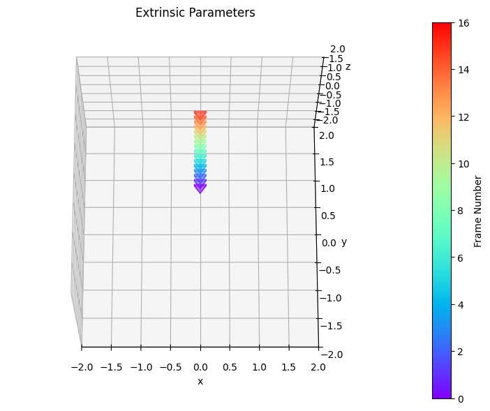
  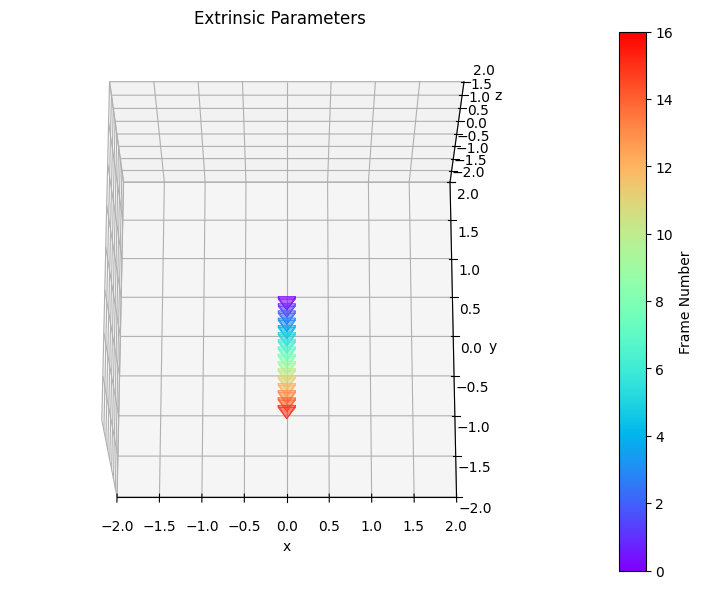
  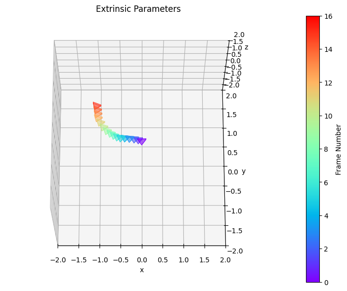
  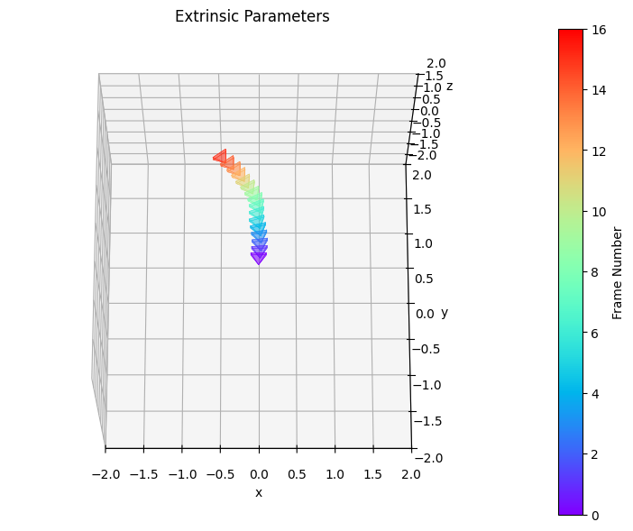
  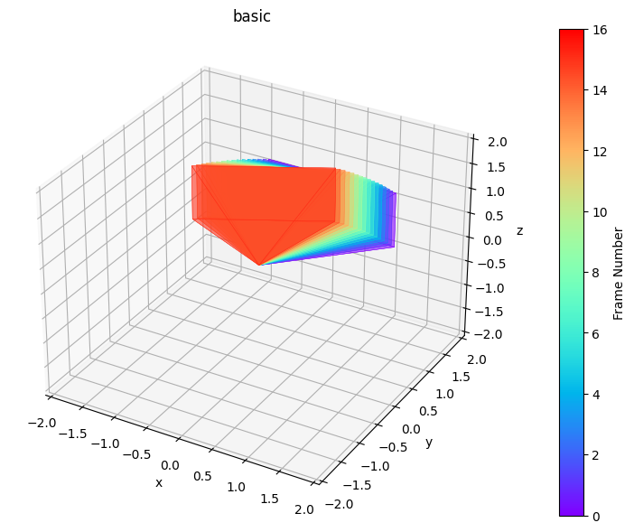
</p>

---

### ⚠️ MotionCtrl in DiT — *Uncontrollable Motion*

<p>MotionCtrl method in DiT has uncontrollable motion.</p>

<p align="center">
  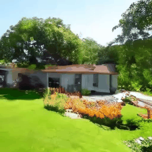
  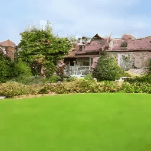
  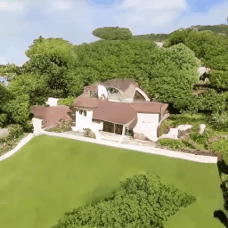
  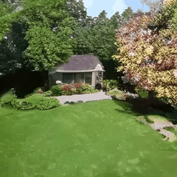
  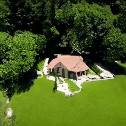
</p>

---

### 🚧 CameraCtrl in DiT — *Limited Motion*

<p>CameraCtrl method in DiT has limited motion.</p>

<p align="center">
  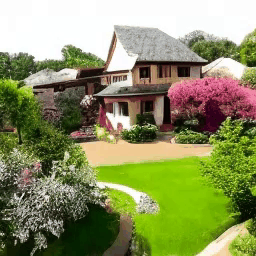
  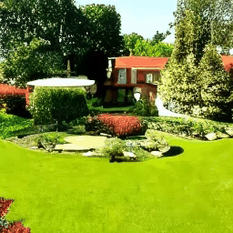
  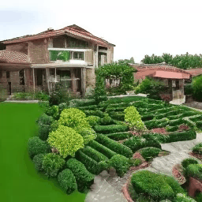
  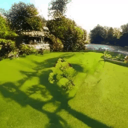
  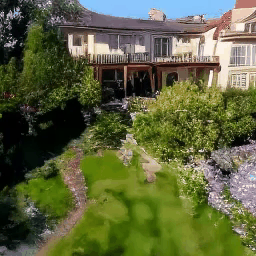
</p>

---

### 🚀 Our Method — *Restored Controllability and Boosted Motion*

<p>Our method restores camera controllability with boosted motion.</p>

<p align="center">
  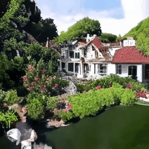
  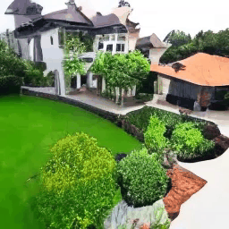
  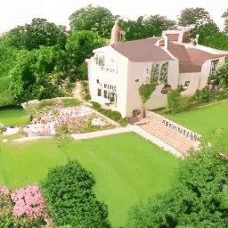
  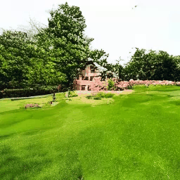
  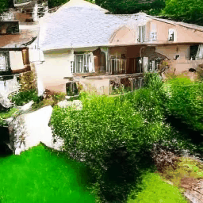
</p>


## Citation
```bibtex
        @inproceedings{cheong2024cmg,
        author    = {Cheong, Soon Yau and Mustafa, Armin and Ceylan, Duygu and Gilbert, Andrew and Huang, Chun-hao Paul},
        title     = {Boosting Camera Motion Control for Video Diffusion Transformers},
        booktitle = {Proceedings of the British Machine Vision Conference (BMVC)},
        year      = {2025}}
```

## Installation
```
pip install uv
uv python install 3.10
uv sync
source .venv/bin/activate 
```

## Download models
Download model folder e.g. /cameratrlcmg from https://huggingface.co/soonyau/cmg/tree/main to "./models"
```
MODEL_NAME="cameractrlcmg"
huggingface-cli download soonyau/cmg --repo-type=model --local-dir ./models/${MODEL_NAME}$ --include "${MODEL_NAME}$/*"
```

Disable acceleration extras in config.py as compiling GPU-specific CUDA extensions can fail with incompatible build environment. 
```
    enable_flashattn=False,
    enable_layernorm_kernel=False,
    ...
    shardformer=False,
```

## Inference
Run the script and pass in the model path e.g. `bash scripts/inference.sh models/cameractrlcmg`. Change camera pose and text prompt in config.py in model path.


